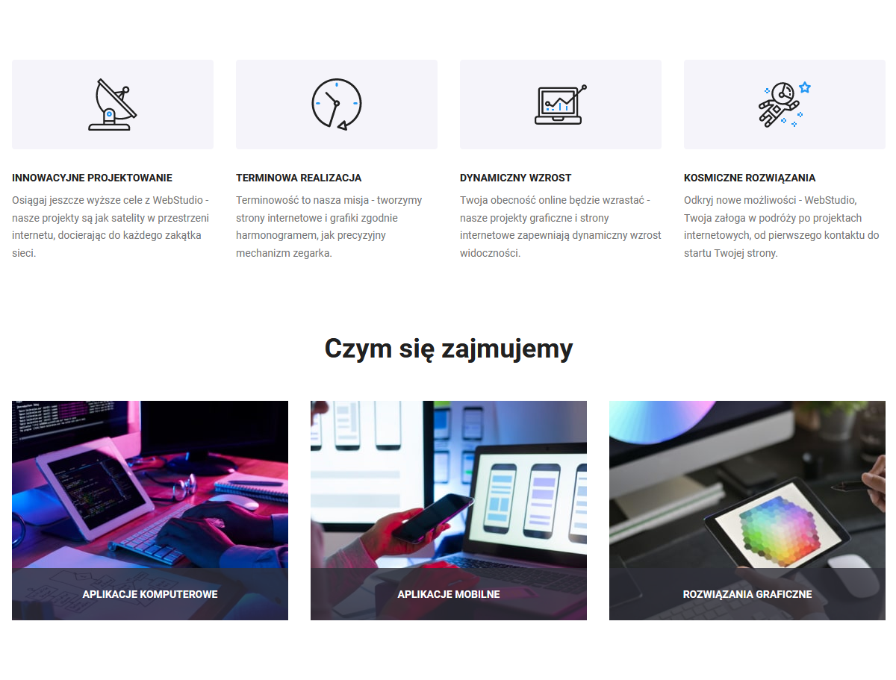
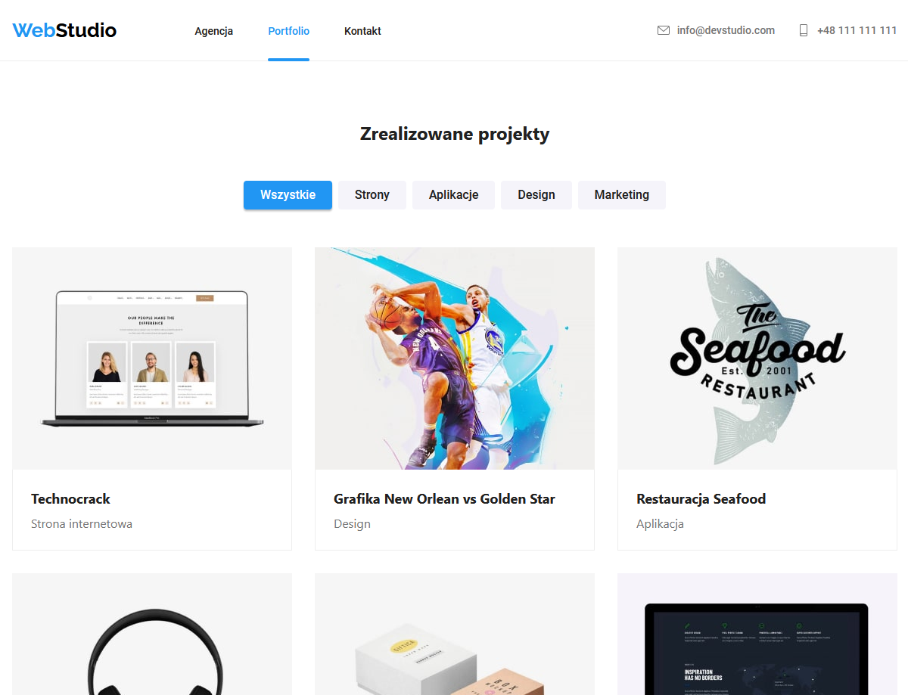
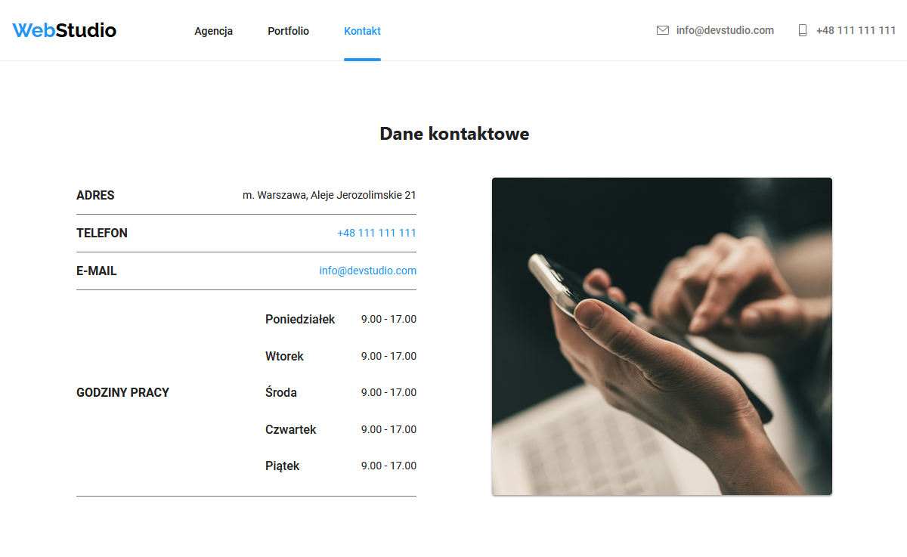
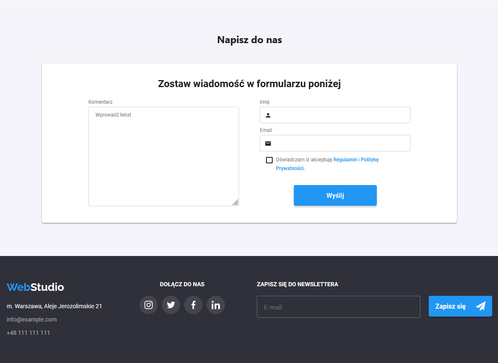

# Non existing company portfolio

WebStudio is a responsive website created using HTML, CSS (utilizing the SASS preprocessor), and JavaScript technologies. This project served as a learning exercise where I first practiced HTML and CSS. 

After a few months, I refreshed the styles, repository, and added a Contact page, making it quite an experience to update my old CSS. 😅

## Demo

🔗 [Finished website](https://dag-szad.github.io/WebStudio/)
## Tech Stack

🔨 **HTML**, **CSS** with **SASS**, and a little bit of **Java Script**.

## Screenshots

##### Main page

##### Portfolio page

##### Contact page

## Roadmap

##### Done:

- ✅ **Pages HTML and basic styles** - All necessary HTML pages have been created with basic styling applied to ensure functionality.
- ✅ **CSS optimization and fixes** - CSS files have been optimized for performance, and any existing issues have been resolved to improve user experience.
- ✅ **Contact page with styles** - The Contact page has been implemented and styled to maintain consistency with the rest of the website.
- ✅ **Accessibility Certification** - The website now provides accessibility features and complies with accessibility standards as confirmed by [accesScan report](https://acsbace.com/reports/6647614ee7ad6300031e6510?brandId=6647616f69edf500039fc158&_hsenc=p2ANqtz--D1uzLs6y74EJuua3bra7MaIY6134lR9FGmVGjpK9Pbf3nPWPqixO6dKhEoAq3DJ1T_3auaC04t4HwyIqnr7zrExw3-g&_hsmi=90649158).

##### To Do:

- ❌ **Project sorting and/or filtering on Portfolio page** - Implement functionality to allow users to sort or filter projects on the Portfolio page, enhancing usability and navigation.

## Authors

- Dag
    - [Linkedin](https://www.linkedin.com/in/dagmara-szadkowska-708423255)
    - [GitHub](https://www.github.com/dag-szad)

## Feedback

If you have any feedback, comments, tips, please reach out to me at LinkedIn. 🤗

